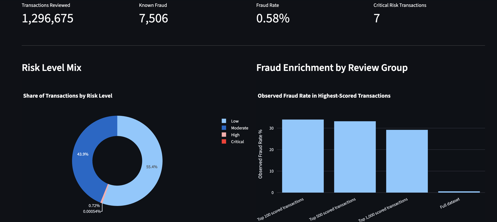
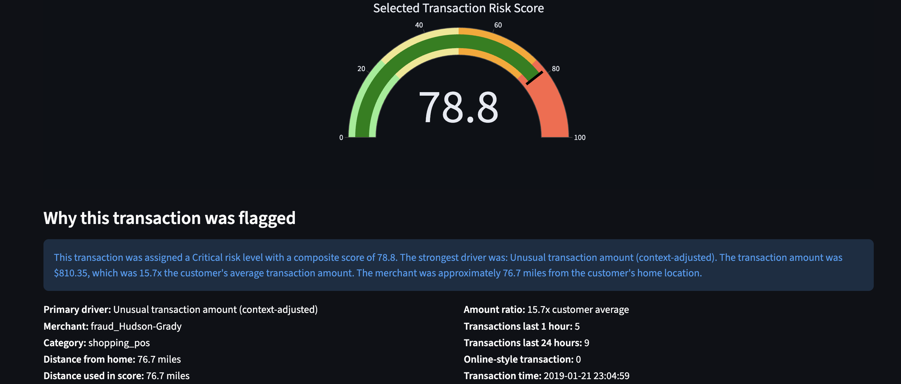
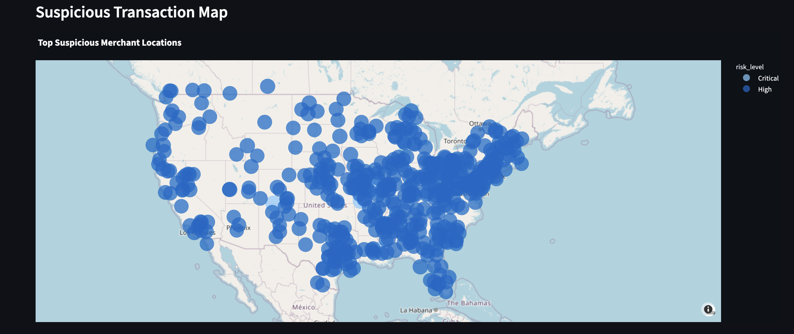
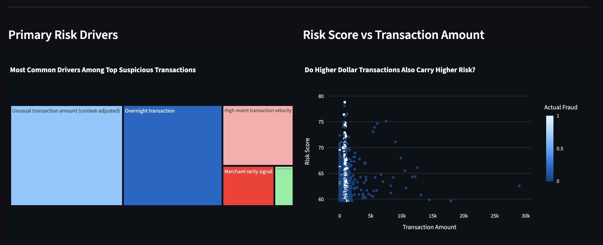

# Fraud & Anomaly Detection Dashboard

Interactive fraud investigation and anomaly detection project built in Python using explainable risk scoring, behavioral analytics, and an investigator-style dashboard.

The project evaluates suspicious transactions using transparent fraud signals rather than black-box models and provides an explainable workflow for reviewing high-risk activity.

---

# Dashboard Preview

## Dashboard Overview



Executive view showing:

- Transaction counts
- Fraud prevalence
- Risk distribution
- Fraud enrichment analysis

---

## Fraud Investigator



Interactive investigation workflow displaying:

- Composite risk score
- Risk gauge
- Human explanations
- Velocity metrics
- Online transaction handling
- Travel-aware scoring adjustments

---

## Risk Map



Geographic review of suspicious merchant activity.

Distance risk is automatically reduced for online-style transactions.

---

## Risk Driver Analysis



Analytical layer showing:

- Primary fraud drivers
- Risk relationships
- Fraud enrichment
- Amount vs score behavior

---

# Project Goal

Identify suspicious transactions using explainable business logic.

Signals include:

- Amount anomaly
- Transaction velocity
- Geographic distance
- Overnight activity
- Merchant rarity
- Online purchase adjustment
- Travel purchase adjustment

---

# Workflow

Raw Transaction Data

↓

Feature Engineering

↓

Behavioral Signal Creation

↓

Composite Risk Scoring

↓

Fraud Enrichment Evaluation

↓

Interactive Dashboard

↓

Investigator Review

---

# Dataset

Files used locally:

```text
fraudtrain.csv
fraudtest.csv
```

Training dataset:

- 1,296,675 transactions

Testing dataset:

- 555,719 transactions

Observed fraud prevalence:

```text
~0.58%
```

Raw datasets are intentionally excluded from the repository.

---

# Fraud Signals

## Amount Risk (25%)

Measures:

```text
Transaction Amount
÷
Customer Average Spend
```

Large deviations increase risk.

Travel-related transactions receive reduced amount sensitivity.

Examples:

Normal customer spend:

```text
$40
```

Travel purchase:

```text
$600 hotel
```

Risk contribution reduced.

---

## Velocity Risk (25%)

Uses real behavioral windows:

```text
Transactions in last 1 hour

+

Transactions in last 24 hours
```

Captures:

- Bursts
- Rapid activity
- Frequency spikes

---

## Distance Risk (15%)

Calculates:

```text
Customer Location

↓

Merchant Location
```

Online-style categories automatically reduce distance impact.

Examples:

```text
shopping_net
misc_net
grocery_net
```

Distance becomes less influential.

---

## Time Risk (10%)

Flags:

```text
11 PM – 5 AM
```

Captures overnight behavior.

---

## Merchant Rarity Signal (25%)

Measures merchant frequency.

Important:

Rare merchant ≠ fraud

Merchant rarity is only one signal.

---

# Composite Risk Score

Final score:

```text
25% Amount Risk

+

25% Velocity Risk

+

15% Distance Risk

+

10% Time Risk

+

25% Merchant Rarity Signal
```

Risk ranges:

Low:

```text
0–24.9
```

Moderate:

```text
25–49.9
```

High:

```text
50–74.9
```

Critical:

```text
75–100
```

Important:

The score is:

✅ Relative ranking

NOT:

❌ Fraud probability

Example:

```text
Risk Score = 70
```

Does NOT mean:

```text
70% chance of fraud
```

---

# Evaluation Layer

Model evaluation includes:

- Fraud enrichment
- Top 100 review group
- Top 500 review group
- Top 1,000 review group
- Full dataset comparison

Purpose:

Determine whether higher-risk transactions show increased fraud concentration.

---

# Dashboard Features

## Executive KPIs

Displays:

- Transactions reviewed
- Known fraud count
- Fraud rate
- Critical transaction count

---

## Fraud Investigator

Review suspicious transactions individually.

Shows:

- Risk score
- Fraud label
- Primary driver
- Merchant
- Category
- Distance
- Travel flag
- Online flag
- Velocity windows
- Human explanation

---

## Visualizations

Dashboard includes:

- Donut chart
- Fraud enrichment chart
- Risk trend analysis
- Geographic transaction map
- Risk gauge
- Treemap
- Scatter analysis
- Transaction review table

---

# Output Workbook

Generated:

```text
fraud_analysis_output.xlsx
```

Sheets:

- Executive_Summary
- Top_Suspicious
- Risk_Summary
- Fraud_By_Risk
- Model_Evaluation
- Score_Distribution
- Model_Breakdown
- Limitations

---

# Project Structure

```text
fraud-anomaly-dashboard/

fraud_analysis.py
dashboard.py
fraud_config.json
README.md
requirements.txt

sample_outputs/
└── fraud_analysis_output.xlsx

screenshots/
├── dashboard_overview.png
├── fraud_investigator.png
├── risk_map.png
└── risk_drivers_analysis.png
```

---

# How To Run

Create environment:

```bash
python3 -m venv .venv
```

Activate:

```bash
source .venv/bin/activate
```

Install:

```bash
pip install -r requirements.txt
```

Run analysis:

```bash
python3 fraud_analysis.py
```

Launch dashboard:

```bash
streamlit run dashboard.py
```

---

# Skills Demonstrated

Analytics:

- Fraud detection
- Anomaly detection
- Behavioral scoring
- Feature engineering
- Explainable analytics
- Evaluation design

Technical:

- Python
- Pandas
- Streamlit
- Plotly
- OpenPyXL

Business:

- Fraud investigation
- Risk communication
- Decision support
- Human-readable reporting

---

# Known Limitations

- Risk score is not probability
- Distance logic simplified
- Travel logic category-based
- Merchant rarity is contextual
- Rule-based scoring used intentionally

Future improvements:

- Card-present indicators
- Merchant networks
- Fraud rings
- Temporal sequence analysis
- Graph analytics
- ML comparison layer

---

# Disclaimer

Created for portfolio and demonstration purposes.

Risk scores represent relative transaction ranking and should not be interpreted as fraud probabilities or production fraud decisions.